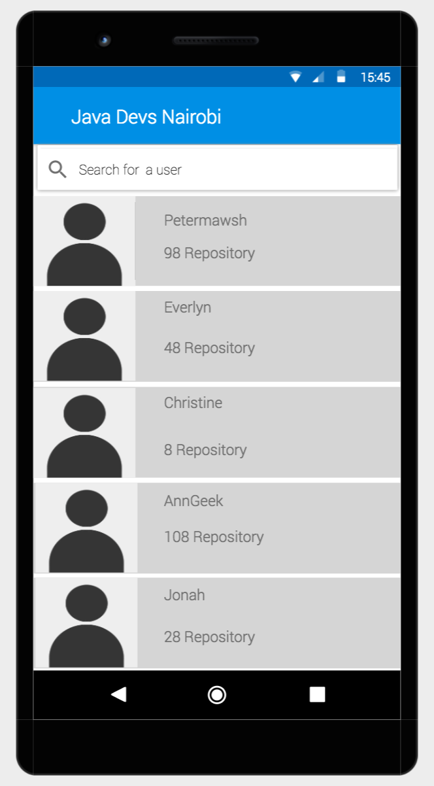
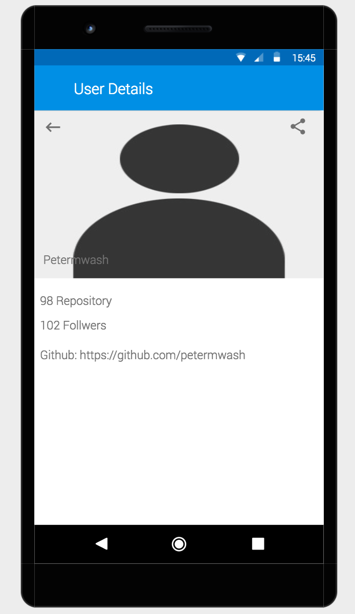
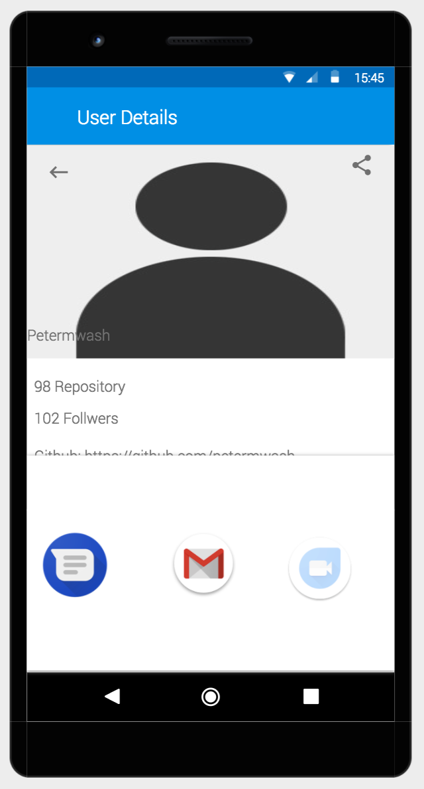

# JavaDevsNairobi
This is an Android app to retrieve a list of Java Developers in Nairobi using the [Github API](https://developer.github.com/v3/search/#search-users).

## Getting Started

To run this app on you machine, ensure that you have Android Studio installed, then follow the steps below to get it working.

- Clone this repository on your machine with the command `git clone https://github.com/petermwash/JavaDevsNairobi.git`.
- Start your Android Studio then click on `file`, then `open`. Now navigate to the folder where you cloned this project and open the folder that was created i.e `JavaDevsNairobi`.
- On your android studio select app then run the app either on an emulator or on an actual device. Enjoy the app 😄.

## Running the tests

- To run tests and generate code coverage report, just run the following command on your terminal `./gradlew clean jacocoTestReport`.
- Then you can navigate to the directory `app/build/reports/coverage/debug/` and open the `index.html` file on your browser to see the coverage report.

## Screenshots for mock-ups

The mock-ups below are created using the Justinmind wire-framing tool. I chose to use this tool since it has almost every prototype created from a default template, within which default styles have been defined for all UI elements, such as text boxes and data lists and grids. These makes it easy to modify to meet my needs.

